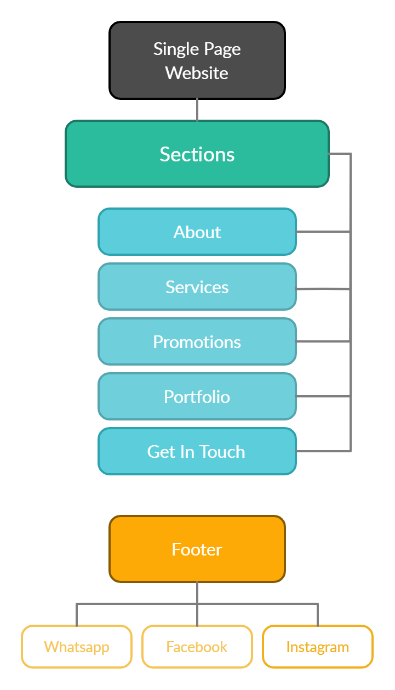

# **TGC DSD Assignment 1**

### Single Page Layout Website

By: Mabel Su
#

## Demo

A live demo of the finished project can be found [here](https://mabelsueh.github.io/trent-assignment-1/).

## **Motivation:**
This project requires us to create a website with interactive elements implemented using JavaScript, while also demonstrating 
understanding of the Five Planes of UI/UX. I have chosen to create an single page website with the purpose of advertising bespoke leather crafting services with a user-friendly and aesthetically pleasing site that can be navigated intuitively. 

# 
## **Goals & User stories:**

### Owner's Goal:  To advertise my service online with ease and receive enquiries.

### Owner's User Stories:
-  As an owner, I want my customers to have a smooth browsing experience. 
-  As an owner, I want to update my promotions easily so they can be changed seasonally. 
-  As an owner, I want to display customer reviews so that I seem trustable. 

### User's Goal: To view and the website and navigate with ease. 

### User's User Stories:

- As a site visitor, I want the website to be easy to navigate so I can shop easily. 
- As a site visitor, I want to read reviews about the business so I can engage in the service with a peace of mind. 
- As a site visitor, I want to enquire before committing to any consultation or service so I don't waste time and money. 

# 
<!-- 2. List down the scope of the project (features and requirements, non-technical requirements, content requirements) 
Non-functional Requirements (general characteristics): -->
## **Features:** 
- Fixed scrolling website
- Card introducing services with call to action button
- Carousel displaying images of products made, with captions on larger devices detailing customer's review
- Contact form with validation

# 
## **Requirements:** 
- mobile responsiveness: the website should work on as many devices as possible
- performance criteria: the website should load quickly
<!-- (how product behaves - feature, mandatory) -->
<!-- - Reviews should be in bootstrap carousel
- Services sohould be in cards -->
- Promotions should be stored in a separate JSON file. 
- Contact form should have validation. 

# 
## **Content requirements:**
- About section
- Services section
- Promotions section
- Portfolio with review
- Contact section
#

## **Choices behind surface of the project:** 
I chose the background images that gave off a luxurious leather workshop 
vibe and based off the rest of the colour scheme by selecting colors similar to the pictures via a dropper tool.
I chose the Montserrat font in sans-serif as I stumbled upon it while looking through fonts that resembled luxurious brand logos.
In all, the pictures, colours and font choice are all to give off a professional and luxurious feeling so that visitors will have faith in the brand's cratsmanship.
#

# 
## **Structure/ Sitemap:**

Wireframe can be found [here](https://app.moqups.com/mNLMWxHlDC/view/page/a9de4d023)

## **Credits**
- Referenced "Fixed Scrolling" method from: 
[Traversy-Media](https://www.youtube.com/watch?v=JttTcnidSdQ&list=WL&index=1)
- Pictures from various sources:
[Guvasto Fring](https://www.pexels.com/collections/master-works-with-leather-odkibgy/) for background images and
[stocksnap.io](https://stocksnap.io/) for card and carousel images

