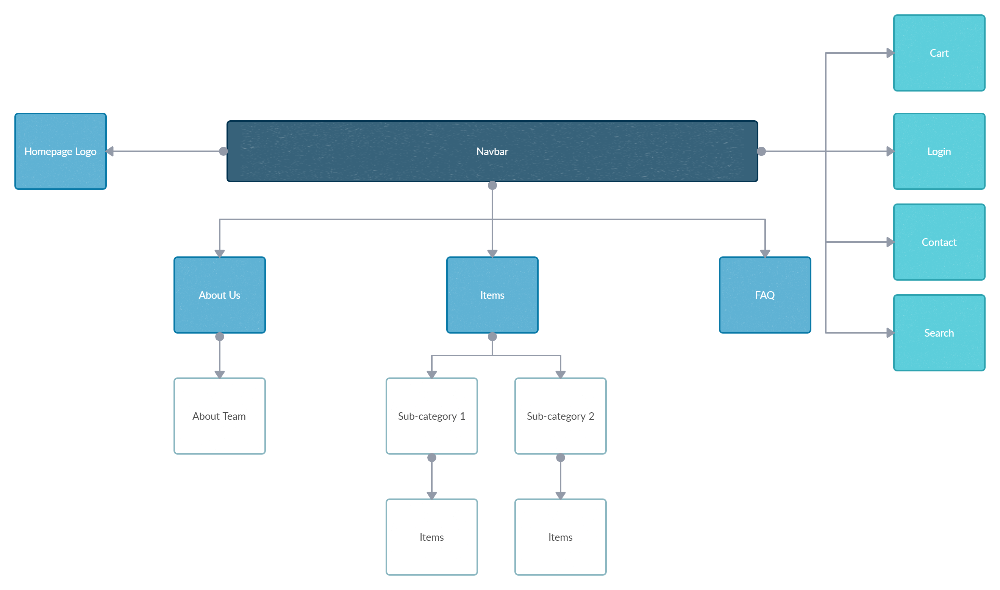

# **TGC DSD Assignment 1**

## **Motivation:**
This project requires us to create a website with interactive elements implemented using JavaScript, while also demonstrating 
understanding of the Five Planes of UI/UX. I have chosen to create an e-commerce site with the purpose of selling quality leathercraft tools and kits 
with a user-friendly and aesthetically pleasing site that can be navigated intuitively. 

# 
## **Goals & User stories:**

### Owner's Goal:  To sell my products online with ease and have good business insights that help in decision-making. 

### Owner's User Stories:
-  As an owner, I want my customers to have a smooth shopping experience. 
-  As an owner, I want to track my customer base so I know how to appeal to them better. 
-  As an owner, I want my website to appear on web engine searches easily. 

### User's Goal: To view and buy items with ease. 

### User's User Stories:
- As a site visitor, I want to read the FAQ section with ease, so I can get the information I'm looking for easily.
- As a site visitor, I want the website to be easy to navigate so I can shop easily. 
- As a site visitor, I want to read reviews about the business so I can purchase with a peace of mind. 
- As a site visitor, I want to check out as a guest so I can make my first purchase without the hassle of creating an account. 
- As a site visitor, I want to view items by category so I can view specific items at a glance. 

# 
<!-- 2. List down the scope of the project (features and requirements, non-technical requirements, content requirements) 
Non-functional Requirements (general characteristics): -->
## **Requirements:** 

### Non-functional Requirements: 
- mobile responsiveness: the website should work on as many devices as possible
- performance criteria: the website should load quickly
- terms and conditions
- 

# 
### Functional Requirements:
<!-- (how product behaves - feature, mandatory) -->
- Guests should be able to check out without creating an account
- The shopping cart icon should always be displayed on top of every page
- Product information should be stored in a separate JSON file
- 

# 
### Content requirements:
- Logo leading to homepage
- Favicon
- Featured items
- Reviews API on the homepage
- About us page
- Items, sub categories & items
- Contact us section with email, phone number, address and maps API
- Login
- Search
- Reviews
- FAQ page 
- Terms of Service
- Social media links

# 
## Structure/ Sitemap: 

# 
4. Provide the skeleton of the project (mock-ups) 
you will read this first

need to answer:
"Where do I click to log in?"
"Did the checkout process succeed?"
"Are there more search results?"
"Does this product meet my needs?"
"What is the total of my shopping cart?"
"How much delivery fees do I have to pay?"

# 
5. Explain the choices behind the surface of the project (why a particular font, color scheme, mood of background images etc.)
● Respect use of whitespace and contrast
● Order and context
● Presentation of information

